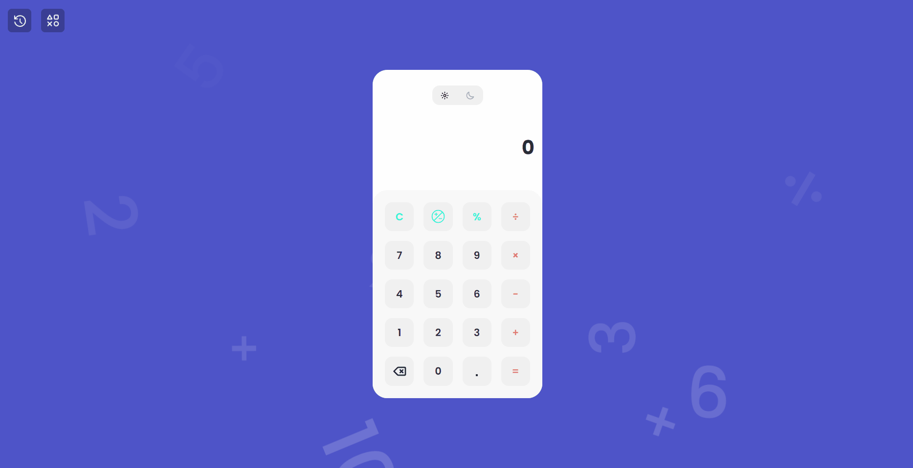
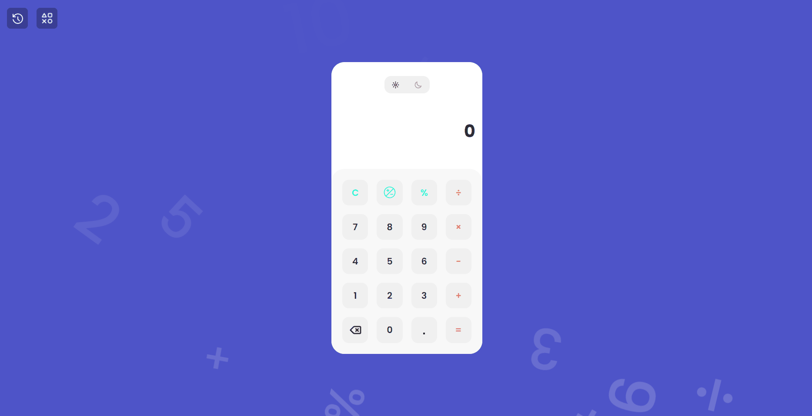
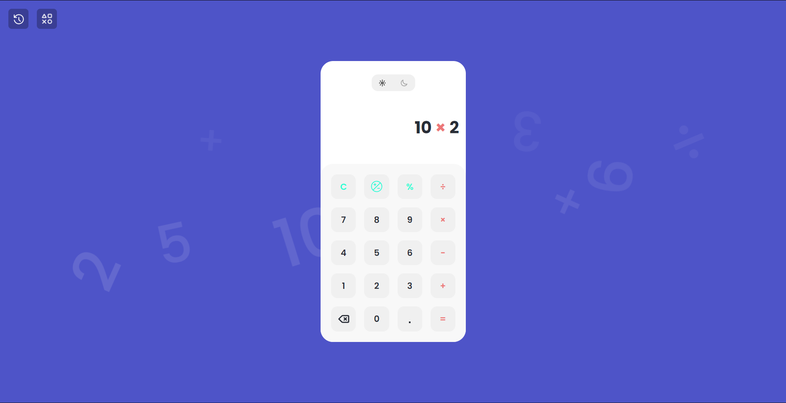
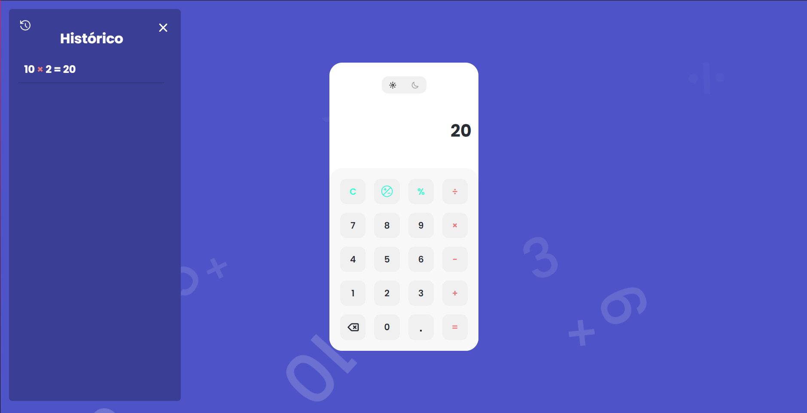
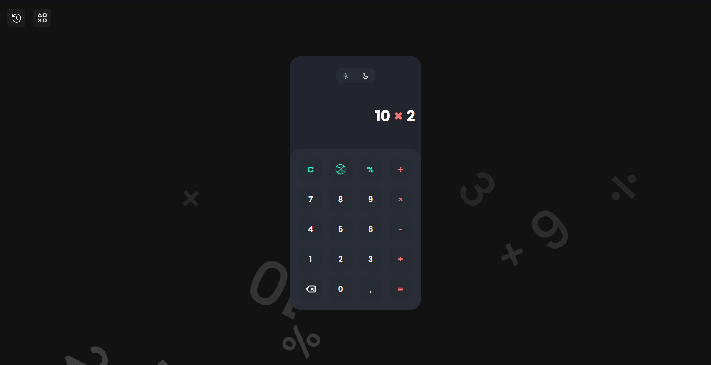
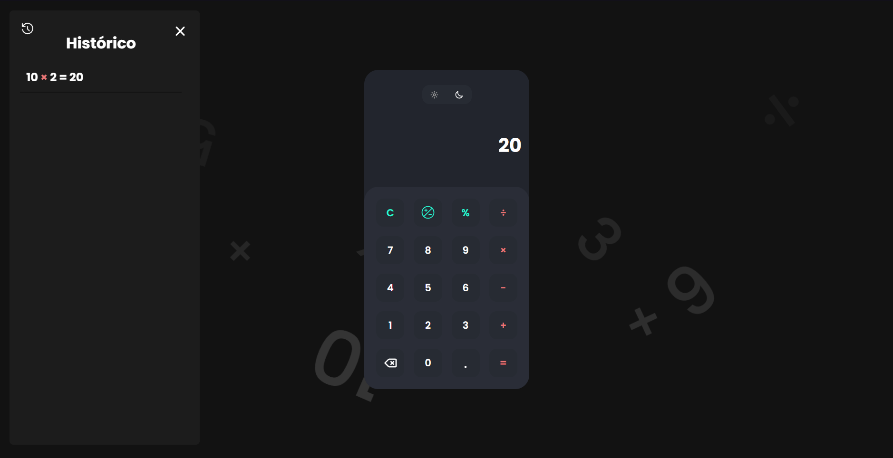

    
    
Essa moderna calculadora irá te ajudar a realizar os cáculos de adição, subtração, multiplicação, divisão e porcentagem 👨🏻‍💻📈📐

<h1 align="center">📌 Tabela de conteúdos<h2>

    <a href="#computer-projeto">• Projeto</a>
    <a href="#camera-demonstração">• Demonstração</a>
    <a href="#hammer_and_wrench-tecnologias">• Tecnologias</a>
    <a href="#link-pré-requisitos">• Pré-Requisitos</a>
    <a href="#technologist-instalação">• Instalação</a>

<h4 align="center"> 
	✅  Calculator 🚀 Finalizado  ✅
</h4>

## :computer: **Projeto**
Esse projeto foi desenvolvido com o objetivo de aprimorar meus conhecimentos em HTML, CSS, JavaScript, git e alguns conceitos do Clean Code. Além disso, um dos grandes objetivos do projeto era produzir uma página com um Design moderno e com diversas animações, trazendo uma melhor experiência para o usuário. Por fim, o Design de <a href="https://dribbble.com/shots/14709020-Calculator">Lucia Scott</a> foi utilizado como base e os ícones foram obtidos a partir dos respectivos sites: <a href="https://lordicon.com">Lordicon</a> e <a href="https://iconify.design">Iconify</a> :wink: !

## :camera: **Demonstração**

    
    

#### Tema claro

    
    

#### Tema escuro

    
    

## :hammer_and_wrench: **Tecnologias**
- HTML
- CSS
- JavaScript
- **[Iconify](https://iconify.design)**
- **[Lordicon](https://lordicon.com)**

## :link: **Pré-Requisitos**
Antes de começar, é interessante ter um bom editor de código para trabalhar, como o <a href="https://code.visualstudio.com/Download">Visual Studio Code</a> e utilizar o <a href="https://marketplace.visualstudio.com/items?itemName=ritwickdey.LiveServer">Liver Server</a> para visualizar o site.

## :technologist: **Instalação**
1. Clonar repositório
2. Abrir o VSCODE com o repositório
3. Abra o servidor localmente cliando no botão "Go Live" localizado no canto inferior direito

Todos os tipos de contribuições são muito bem-vindos e apreciados!
- ⭐️ Favoritar o projeto!
- 🐛 Encontrar e relatar problemas!
- 💡 Relatar dicas para a evolução do projeto

Feito por Diego de Sousa 👋 <a href="https://www.linkedin.com/in/diego-sousa-28003b209/">Entre em contato!</a>